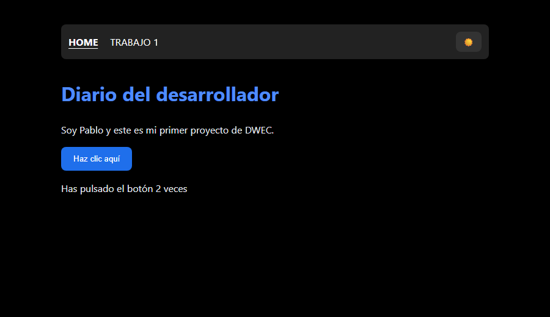
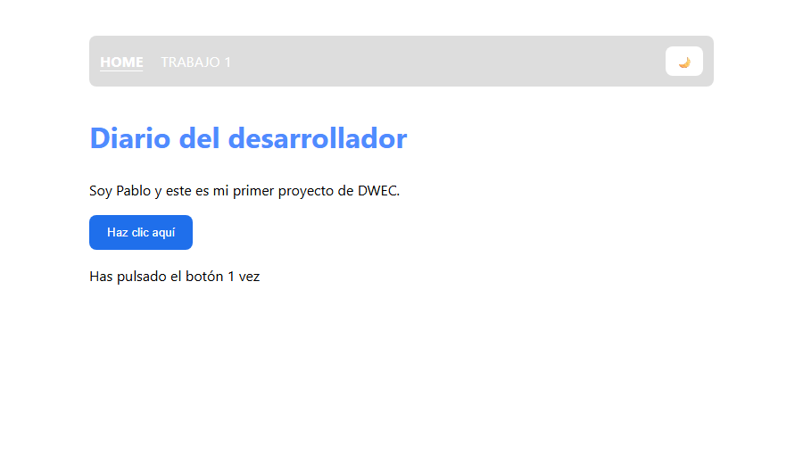

# Diario del desarrollador · DWEC

[](https://github.com/sanchezcontentopablo-max/Pablo_Sanchez_DWEC/actions/workflows/validar.yml)


Soy **Pablo Sánchez**, estudiante de **2.º de DAW**. Este repositorio recoge los
trabajos y prácticas de la asignatura **Desarrollo Web en Entorno Cliente**,
hechos con HTML, CSS y JavaScript y publicados con GitHub Pages.

🌐 **Ver la web:** <https://sanchezcontentopablo-max.github.io/Pablo_Sanchez_DWEC/>

| Modo noche | Modo claro |
|---|---|
|  |  |

## Trabajos

| Nº | Trabajo | Qué se practica | Enlace |
|---|---|---|---|
| — | Página principal | Estructura HTML, estilos, eventos y DOM | [Abrir](https://sanchezcontentopablo-max.github.io/Pablo_Sanchez_DWEC/) |
| 1 | Trabajo 1 | Navegación entre páginas con estilos compartidos | [Abrir](https://sanchezcontentopablo-max.github.io/Pablo_Sanchez_DWEC/trabajo1.html) |

## Funcionalidades

- **Contador de clics** que actualiza la página con `textContent`.
- **Modo noche / modo claro** con un botón en el menú:
  - la elección se guarda en `localStorage` y se mantiene al cambiar de página;
  - la primera vez se respeta la preferencia del sistema operativo (`prefers-color-scheme`);
  - si el navegador bloquea el almacenamiento, el cambio de tema sigue funcionando.
- **Accesibilidad:** etiqueta `aria-label` en el botón de tema, `aria-current` en
  el enlace de la página actual, foco visible con teclado y avisos con `aria-live`.
- HTML validado automáticamente con [html-validate](https://html-validate.org/) en cada *push*.

## Estructura

```text
├── index.html      # página principal
├── trabajo1.html   # trabajo 1
├── estilos.css     # estilos compartidos y tema claro
├── app.js          # contador y modo noche
└── docs/           # capturas para este README
```

## Verlo en local

No necesita instalación: abre `index.html` en el navegador, o sirve la carpeta
para probarlo como en GitHub Pages:

```bash
python -m http.server 8000
# y abre http://localhost:8000
```

Para validar el HTML como hace la integración continua:

```bash
npx html-validate "**/*.html"
```

## Autor

**Pablo Sánchez Contento** · [GitHub](https://github.com/sanchezcontentopablo-max)
